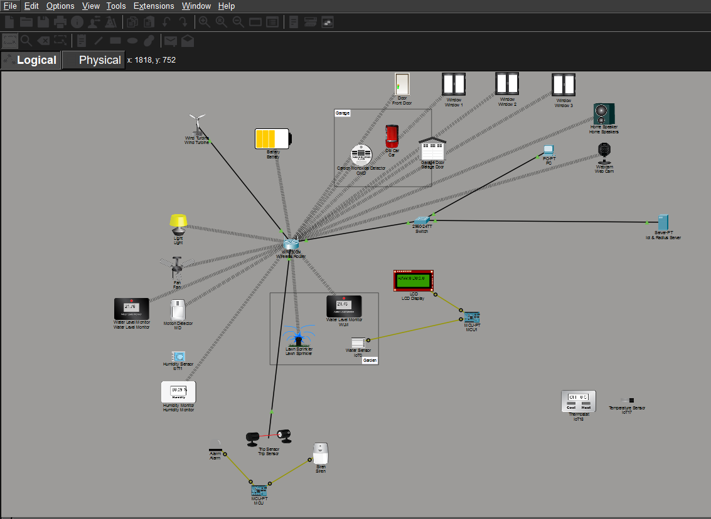

# Cisco Packet Tracer – IoT Smart Home & Water Level Monitoring

## Project Topology

## Overview
A complete IoT-based smart home simulation built in Cisco Packet Tracer, integrating
monitoring, automation, security, and networking in a single system.

## Key Features
- Water level monitoring using **Water Sensor + MCU + LCD**
- Lawn sprinkler monitoring logic
- Temperature and humidity sensing
- Motion detection with alarm & siren
- Carbon monoxide detection
- Smart doors, windows, lights, fan, speaker
- Webcam-based monitoring
- Wind turbine with battery storage
- Centralized IoT control via Wireless Home Router
- Remote monitoring using PC & IoT Server

## Architecture
Sensors → MCU → LCD / Actuators → Wireless Router → Switch → Server → Remote User

## Tools Used
- Cisco Packet Tracer
- IoT Sensors & Actuators
- MCU + Embedded Logic
- Networking Devices (Router, Switch, Server)

## Purpose
Hands-on exploration of **end-to-end IoT system design**, not a guided lab.
